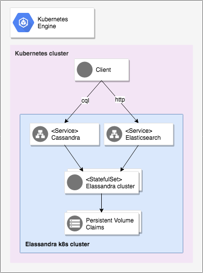

# Elassandra Google k8s Marketplace


This repository contains instructions and files necessary for running [Elassandra](https://github.com/strapdata/elassandra) via 
[Google's Hosted Kubernetes Marketplace](https://console.cloud.google.com/marketplace/browse?filter=solution-type:k8s).

# Overview

As shown in the following figure, Elassandra nodes are deployed as a kubernetes statefulset, and expose two kubernetes services, one for Apache Cassandra, one for Elasticsearch.



# Using the build tools

### Setup the GKE environment

See `setup-k8s.sh` for instructions.
These steps are only to be followed for standing up a new testing cluster for the purpose of testing the code in this repo.


### Build the container images

The make task `app/build` is used to build two container images :
* a deployer that transforms our Elassandra helm chart into a GKE manifest
* an Elassandra image.

```
export TAG=6.2.3.8
make app/build
```

### Install the application

The make task `app/install` simulates a google marketplace environment and deploys the elassandra application.

```
make app/install
```

Once deployed, the application will appears on the google cloud console.

To stop/delete, use the make tasks `make app/uninstall`. You also need to delete the pvc : 
```bash
make app/uninstall
for i in 0 1 2; do
  kubectl delete pvc data-$NAME-$i
done
```

### Configure the application

The `schema.yml` file contains parameters available to the GKE end-user.

In order to specify values for these parameters, you can either define environment variables or edit the `Makefile`:
```Makefile
APP_PARAMETERS ?= { \
  "name": "$(NAME)", \
  "namespace": "$(NAMESPACE)", \
  "image.name": "$(APP_MAIN_IMAGE)" \
}
```

For instance if you wish to increase the disk size :
```Makefile
APP_PARAMETERS ?= { \
  "name": "$(NAME)", \
  "namespace": "$(NAMESPACE)", \
  "image.name": "$(APP_MAIN_IMAGE)" \
  "persistence.size": "512Gi" \
}
```

### Running Tests

```
make app/verify
```

That `app/verify` target, like many others, is provided for by Google's
marketplace tools repo; consult app.Makefile in that repo for full details. 

# Getting started with Elassandra

### Set your GKE environment

Setup your environment as describe in [GKE quickstart](https://cloud.google.com/kubernetes-engine/docs/quickstart):
```
gcloud config set project <your-gcp-project>
gcloud config set compute/zone <your-zone>
gcloud container clusters get-credentials <your-gke-cluster-name>
```
	
### Set env variables according to your cluster

Set the following environment variables according to your deployment:
```
export NAMESPACE=default
export APP_INSTANCE_NAME=elassandra-1
export ELASSANDRA_POD=$(kubectl get pods -n $NAMESPACE -l app=elassandra,release=$APP_INSTANCE_NAME -o jsonpath='{.items[0].metadata.name}')
```

### Accessing Cassandra

Check your cassandra cluster status by running the following command :
```shell
kubectl exec "$ELASSANDRA_POD" --namespace "$NAMESPACE" -c elassandra -- nodetool status
```

Connect to Cassandra using cqlsh:
```shell
kubectl exec -it "$ELASSANDRA_POD" --namespace "$NAMESPACE" -c elassandra -- cqlsh
```

### Accessing Elasticsearch

Check Elasticsearch cluster state and list indices:
```
kubectl exec -it "$ELASSANDRA_POD" --namespace "$NAMESPACE" -c elassandra -- curl http://localhost:9200/_cluster/state?pretty
kubectl exec -it "$ELASSANDRA_POD" --namespace "$NAMESPACE" -c elassandra -- curl http://localhost:9200/_cat/indices?v
```

Add a JSON document:
```
kubectl exec -it "$ELASSANDRA_POD" --namespace "$NAMESPACE" -c elassandra -- curl -XPUT -H "Content-Type: application/json" http://localhost:9200/test/mytype/1 -d '{ "foo":"bar" }'
```

### Accessing Elassandra using the headless service

A headless service creates a DNS record for each elassandra pod. For instance :
```
$ELASSANDRA_POD.$APP_INSTANCE_NAME.default.svc.cluster.local
```

Clients running inside the same k8s cluster could use thoses records to access both CQL, ES HTTP, ES transport, JMX and thrift protocols (thrift is not supported with elasticsearch).

### Accessing Elassandra with port forwarding

You could also use a local proxy to access the service.

Run the following command in a separate background terminal:
```shell
kubectl port-forward "$ELASSANDRA_POD" 9042:9042 9200:9200 --namespace "$NAMESPACE"
```

In you main terminal (requires curl and cqlsh commands):
```shell
curl localhost:9200
cqlsh --cqlversion=3.4.4
```

### Deploying Kibana (requires helm installed)

Start a Kibana pod with the same Elasticsearch version as the one provided by Elassandra. By default, Kibana connects to the Elasticsearch service on port 9200.

```
helm install --namespace "$NAMESPACE" --name kibana --set image.tag=6.2.3 --set service.externalPort=5601 stable/kibana
```

To delete Kibana :
```
helm delete kibana --purge
```

### Deploying Filebeat

Elassandra can be used beside Filebeat and Kibana to monitor k8s logs :

```
kubectl create -f extra/filebeat-kubernetes.yaml
```

Open Kibana to see the logs flowing to Elassandra :

```
export POD_NAME=$(kubectl get pods --namespace default -l "app=kibana,release=kibana" -o jsonpath="{.items[0].metadata.name}")
echo "Visit http://127.0.0.1:5601 to use Kibana"
kubectl port-forward --namespace default $POD_NAME 5601:5601
```

To delete Filebeat :

```
kubectl delete -f extra/filebeat-kubernetes.yaml
```

# Backup and Restore

### Overview

Elassandra can snapshot Elasticsearch indices when the index settings **index.snapshot_with_sstable=true**. In this case, snapshoting a Cassandra keyspace also create a snapshot of lucene files located in *$CASSANDRA_DATA/elasticsearch.data/<cluster_name>/nodes/0/indices/<index_name>/0/index/(_\*|segment\*)*.

**IMPORTANT**: Since Elassandra version 6.2.3.8+, Elasticsearch mapping is stored as binary in the Cassandra schema as table extensions, but **cqlsh** does not display it when issuing DESCRIBE KEYSPACE or DESCRIBE TABLE. Nevertheless, when snapshoting a table, Cassandra backups the CQL schema in a file **schema.cql** including table extensions. So we recommand to always snapshot the table **elastic_admin.metadata** to backup the elasticsearch metadata. Here is an example of such **schema.cql** generated by *nodetool snapshot elastic_admin*  in /var/lib/cassandra/data/data/elastic_admin/metadata-d05583c0f9a711e88d516196b00e4901/snapshots/1544183249126/schema.cql:

	CREATE TABLE IF NOT EXISTS elastic_admin.metadata (
		cluster_name text PRIMARY KEY,
		owner uuid,
		version bigint)
		WITH ID = afa8fcd0-f969-11e8-bb96-abe02913d577
		AND bloom_filter_fp_chance = 0.01
		AND dclocal_read_repair_chance = 0.1
		AND crc_check_chance = 1.0
		AND default_time_to_live = 0
		AND gc_grace_seconds = 864000
		AND min_index_interval = 128
		AND max_index_interval = 2048
		AND memtable_flush_period_in_ms = 0
		AND read_repair_chance = 0.0
		AND speculative_retry = '99PERCENTILE'
		AND comment = ''
		AND caching = { 'keys': 'ALL', 'rows_per_partition': 'NONE' }
		AND compaction = { 'max_threshold': '32', 'min_threshold': '4', 'class': 'org.apache.cassandra.db.compaction.SizeTieredCompactionStrategy' }
		AND compression = { 'chunk_length_in_kb': '64', 'class': 'org.apache.cassandra.io.compress.LZ4Compressor' }
		AND cdc = false
		AND extensions = { 'metadata': '3a290a05fa886d6574612d64617461fa8676657273696f6eca8b636c75737465725f757569646336376539363764342d666561612d343539632d393437332d3334613561623033396437668874656d706c61746573fafb86696e6469636573fa866d79696e646578fa41c4847374617465436f70656e8773657474696e6773fa92696e6465782e6372656174696f6e5f646174654c3135343431323137303137343592696e6465782e70726f76696465645f6e616d65466d79696e64657889696e6465782e75756964556b634c782d506b575466437272425a73494b5a69564194696e6465782e76657273696f6e2e637265617465644636303230333939fb86616c6961736573fafbfbfb8e696e6465782d677261766579617264fa89746f6d6273746f6e6573f8fa84696e646578fa89696e6465785f6e616d6543746f746f89696e6465785f7575696455355f2d7a32577862526c5365644e343575622d643577fb9464656c6574655f646174655f696e5f6d696c6c6973250133611a3008a8fbf9fbfbfb', 'owner': '67e967d4feaa459c947334a5ab039d7f', 'version': '0000000000000005' };

### Backing up your Eassandra data

These steps back up your Cassandra data, database schema, and token information.

Set your installation name and Kubernetes namespace:

```shell
export APP_INSTANCE_NAME=elassandra-1
export NAMESPACE=default
```

The script [`scripts/backup.sh`](scripts/backup.sh) does the following:

1. Uploads the [`make_backup.sh`](scripts/make_backup.sh) script to each container.
2. Runs the script to create a backup package, using the `nodetool snapshot` command.
2. Downloads the backup to your machine.

After you run the script, the `backup-$NODENUMBER.tar.gz` file contains the backup for each node.

Run the script using the following options:

```shell
scripts/backup.sh --keyspace demo \
                  --namespace "${NAMESPACE}" \
                  --app_instance_name "${APP_INSTANCE_NAME}"
```

This script generates one backup file for each Cassandra node. For your whole
cluster, one schema and one token ring is backed up.

### Restoring in place

You can restore SSTables and Elasticsearch Lucene files on the node where the backup was done, because data distribution remains unchanged. In this case, see Elassandra documentation [Restoring a snapshot](http://doc.elassandra.io/en/latest/operations.html#restoring-a-snapshot).

### Restoring

Before restoring indexed tables, recreate the corresponding elasticsearch indices or restore first the keyspace **elastic_admin** keyspace. Once these elasticsearch indices are green (shards STARTED), restore your cassandra data as usual.

When restoring data from another cluster, data distribution is not preserved, and the `sstableloader` send each restored rows to the appropriate nodes depending on token ranges distribution. If Elasticsearch indices are STARTED before restoring, data are automatically re-indexed in elasticsearch on each nodes while restoring with `sstableloader`.

Set your installation name and Kubernetes namespace:

```shell
export APP_INSTANCE_NAME=elassandra-1
export NAMESPACE=default
```

To restore Cassandra, you use the `sstableloader` tool. The restore process
is automated in [`scripts/restore.sh`](scripts/restore.sh). Your source and
destination clusters can have a different number of nodes.

In the directory that contains your backup files, run the restore script:

```shell
scripts/restore.sh --keyspace demo \
                   --namespace "${NAMESPACE}" \
                   --app_instance_name "${APP_INSTANCE_NAME}"
```

The script recreates the schema and uploads data to your cluster.

# Updating elassandra

Before upgrading, we recommend to snapshot your data.

## Update the cluster nodes

### Patch the StatefulSet with the new image

Set your installation name and Kubernetes namespace:

```shell
export APP_INSTANCE_NAME=elassandra-1
export NAMESPACE=default
```

Assign the new image to your StatefulSet definition:

```shell
IMAGE_ELASSANDRA=[NEW_MAGE_REFERENCE]

kubectl set image statefulset "${APP_INSTANCE_NAME}-elassandra" \
  --namespace "${NAMESPACE}" "elassandra=${IMAGE_ELASSANDRA}"
```

After this operation, the StatefulSet has a new image configured for the
containers. However, because of the OnDelete update strategy on the
StatefulSet, the pods will not automatically restart.

### Run the `upgrade.sh` script

To start the rolling update, run the [`scripts/upgrade.sh`](scripts/upgrade.sh) script. The script
takes down and updates one replica at a time.

```shell
scripts/upgrade.sh --namespace "${NAMESPACE}" \
                   --app_instance_name "${APP_INSTANCE_NAME}"

```

# Uninstall the Application

## Using the Google Cloud Platform Console

1. In the GCP Console, open [Kubernetes Applications](https://console.cloud.google.com/kubernetes/application).

1. From the list of applications, click **Elassandra**.

1. On the Application Details page, click **Delete**.

## Using the command line

### Prepare the environment

Set your installation name and Kubernetes namespace:

```shell
export APP_INSTANCE_NAME=elassandra-1
export NAMESPACE=default
```

### Delete the resources

> **NOTE:** We recommend to use a kubectl version that is the same as the version of your cluster. Using the same versions of kubectl and the cluster helps avoid unforeseen issues.

To delete the resources, use the expanded manifest file used for the
installation.

Run `kubectl` on the expanded manifest file:

```shell
kubectl delete -f ${APP_INSTANCE_NAME}_manifest.yaml --namespace $NAMESPACE
```

Otherwise, delete the resources using types and a label:

```shell
kubectl delete application,statefulset,service \
  --namespace $NAMESPACE \
  --selector app.kubernetes.io/name=$APP_INSTANCE_NAME
```

### Delete the persistent volumes of your installation

By design, the removal of StatefulSets in Kubernetes does not remove
PersistentVolumeClaims that were attached to their Pods. This prevents your
installations from accidentally deleting stateful data.

To remove the PersistentVolumeClaims with their attached persistent disks, run
the following `kubectl` commands:

```shell
for pv in $(kubectl get pvc --namespace $NAMESPACE \
  --selector app.kubernetes.io/name=$APP_INSTANCE_NAME \
  --output jsonpath='{.items[*].spec.volumeName}');
do
  kubectl delete pv/$pv --namespace $NAMESPACE
done

kubectl delete persistentvolumeclaims \
  --namespace $NAMESPACE \
  --selector app.kubernetes.io/name=$APP_INSTANCE_NAME
```

### Delete the GKE cluster

Optionally, if you don't need the deployed application or the GKE cluster,
delete the cluster using this command:

```
gcloud container clusters delete "$CLUSTER" --zone "$ZONE"
```